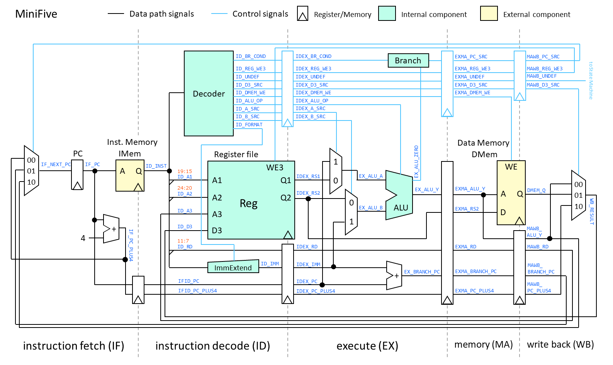

MINIFIVE: a simple (subset of) RISC-V processor
===============================================

Abstract
--------

This repository contains HDL source codes (written in VHDL) of a simple
multi-cycle processor that executes a subset of the RV32I instruction set,
developed for an educational purpose.

The processor only supports nine instructions of RV32I: `add`, `sub`,
`addi`, `and`, `andi`, `lw`, `sw`, `lui`, and `beq`. The design is deeply
inspired from a famous textbook, "Digital Design and Computer Architecture"
by Harris and Harris, yet it always executes one instruction in a fixed
number of (five) cycles for simplification of state transition.

Since 2019, I have been using this processor in my computer architecture
class. Students can run some assembly programs through logic simulation.
They can also try to implement another instruction on the processor.

The above image depicts the schematic of the data path and control of the
processor. You can also find some schematics, including the above image,
in the PowerPoint slide file
<a href="https://github.com/nfproc/MINIFIVE/blob/main/MiniFive_Schematic.pptx">MiniFive_Schematic.pptx</a>.

-----------------------------------------------------------------------

How to Use
----------

NOTE: The test bench has been renewed since the 2022 edition.
You can now initialize program and data memories using text files.

The operation of the processor has been confirmed through logic simulation,
using <a href="http://ghdl.free.fr/">GHDL</a>, a free VHDL simulator.

Source files to be used are all files in the `src` and `src/testbench`
directories. The name of entity of test bench is `MINIFIVE_TEST`.
So, analyze these files and run the simulation with the test bench as the
top module. They can be done by executing GHDL twice on the `testbench`
directory, with the following arguments:

>     GHDL -a -fexplicit -fsynopsys ..\alu.vhdl ..\decoder.vhdl ..\regfile.vhdl ..\signextend.vhdl ..\minifive.vhdl program.vhdl datamemory.vhdl minifive_test.vhdl
>     GHDL -r -fexplicit -fsynopsys MINIFIVE_TEST --ieee-asserts=disable --stop-time=1ms

By default, the test bench has been set up to execute the `fibonacci`
program. The simulation with this program will "fail" at 10,230 ns.
Since the test bench terminates the simulation with an `assert` statement,
this is an expected behavior.

NOTE: This procedure can be easily conducted using my frontend tool,
<a href="https://github.com/nfproc/GGFront">GGFront</a>.

You will find two log files, `_proc_log.txt` and `_dmem_dmp.txt`.
The former is the trace of executed instructions including address,
machine code, destination (register or data memory), and written data.
Destination of `x1`, `x2`, etc. correspond to the register file, while
`*(400)`, `*(404)`, etc. correspond to the data memory.

The latter is the dump of the data memory, along with the number of
executed instruction. Note that invalid (uninitialized in most cases)
words are not dumped.

-----------------------------------------------------------------------

Sample Programs
---------------

The repository includes four test programs in the `program` directory.
Brief explanations of them are as follows:

- `fibonacci`: calculates the 0th-19th terms of Fibonacci sequence,
- `collatz`: calculates the first (up to) 32 terms of Collatz sequence,
- `bubblesort` conducts bubble sort of an array with 8 elements, and
- `squaresum` calculates the sum of square of elements in a vector.

Each program consists of two text files, `(program name)_program.txt`
and `(program name)_data.txt`, to initialize the instruction and data
memories, respectively. Each file is a sequence of 32-bit hexadecimal
words (up to 256 words) to be written to the memory in order.
If the file terminates before 256 lines, the rest of the words will be
left uninitialized.

If you are going to execute another program on MINIFIVE, modify the file
names of `init_file` in `program.vhdl:21` and `datamemory.vhdl:23`.

Since MINIFIVE adopts the Harvard architecture, instruction and data
memories are logically separated. The capacity of the both memories is
set to 1 KiB (32 bit x 256 words), that is, only the lowest 10 bits of
address are valid and the high bits are simply ignored. However, to avoid
confusion, our samples are written as if the data memory is mapped within
the range of 0x400-0x7ff.

In the `reference` directory, you can also find
- a disassembly (`(program name).txt`),
- an instruction trace file (`(program name)_log.txt`), and
- a memory dump file (`(program name)_dmp.txt`)
for each program.

-----------------------------------------------------------------------

Copyright
---------

MINIFIVE is developed by <a href="https://aitech.ac.jp/~dslab/nf/index.en.html">Naoki FUJIEDA</a>.
It is licensed under the New BSD license.
See the COPYING file for more information.

Copyright (C) 2019-2022 Naoki FUJIEDA. All rights reserved.